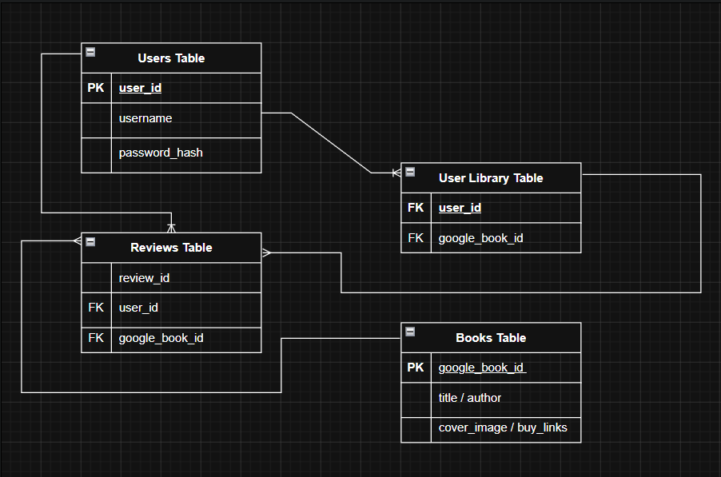

# My Project Plan: BiblioTech Book Discovery App

## 1. My Vision for BiblioTech
BiblioTech is a book discovery and collection manager. Unlike my last project, it uses the Google Books API for content instead of a local database. Users can search for books, read previews, manage a personal library, and leave reviews.

## 2. Core Features (What I want my users to do)
* **Search Bar:** A search bar under the navigation bar lets users search by book title, author, or genre and see results instantly.
* **Search Autocomplete:** As users type in the search bar, a dropdown shows matching books with cover thumbnails and titles.
* **Random Author Quote:** On the left side of the homepage, display one random quote from a hardcoded list of quotes with the author's name. The quote is picked again every time the page loads.
* **Book Carousel:** On the right side next to the quote, display 4 random books from the Google Books API. These books refresh on each page load and the carousel cycles through them every 3 seconds.
* **Genre Buttons:** Below the carousel, display clickable buttons for different genres (Fiction, Sci-Fi, Mystery, Biography, History) so users can explore by category.
* **Search Results Page:** Show 12 book cards per page with Next/Previous buttons for navigation.
* **Book Detail Page:** Show the book cover, description, and buttons to read a preview and buy.
* **Your Library:** A nav link to view saved books. Redirects to login if not authenticated.
* **Reviews & Ratings:** On the book detail page, users can leave a 1-5 star rating and written review. All reviews for that book display below.
* **Authentication:** Implement login, signup, and logout. Guests can browse, but must log in to save books or post reviews.

## 3. Navigation Paths
1. **Fast Path:** Click a book from autocomplete dropdown → go to book detail page
2. **Slow Path:** Submit search or click genre button → see results grid → click a book → go to detail page

## 4. Page Layouts

### Visual Style
* Headings and the brand name should use Cinzel
* Body text, buttons, and form labels should use Roboto
* Use a charcoal-based palette with warm ivory backgrounds and muted gold accents
* Dark mode should use a charcoal background, off-white text, and the same accent color
* The header background behind the title, logo and nav links should use a dark transparent glass look

### Homepage (`index.html`)
* Navigation bar (Home, Your Library, Login, Sign Up)
* Search bar with autocomplete dropdown
* Left side: one random hardcoded quote with author name
* Right side: 4-book carousel (auto-cycles every 3 seconds)
* Bottom: genre buttons (Fiction, Sci-Fi, Mystery, Biography, History)

### Search Results (`search_results.html`)
* Grid of 12 book cards (3x4 layout)
* Each card: cover image, title, author
* Pagination: Previous / Page X / Next

### Book Detail (`book_detail.html`)
* Left: book cover image
* Right: title, author, summary, "Add to My Library" button
* Buttons: "Read Preview" and "Buy"
* Review form: 5-star rating selector and text input
* Reviews list below the form

### Your Library (`your_library.html`)
* Dashboard showing all saved books
* Click a book to go to detail page
* Requires login

### Auth Pages (`login.html` & `signup.html`)
* Login: username, password, link to signup
* Signup: username, password form

## 5. Database Schema

**Users Table**
* User ID, username, password

**Books Table**
* Book ID, title, author, cover image, preview link, buy link
* Use the Google Books `volumeId` as the Book ID
* Insert books here only when a user saves or reviews them

**User_Library Table** (Your Library collection)
* User ID, Book ID

**Reviews Table**
* Review ID, User ID, Book ID, rating (1-5), text

## 6. Technical Notes
* Pick 4 random books automatically for the homepage carousel on each page load
* The carousel should refresh whenever the page reloads
* This keeps the homepage dynamic and simple

