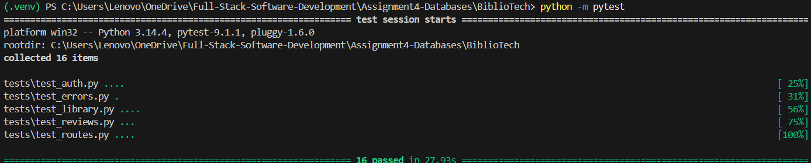
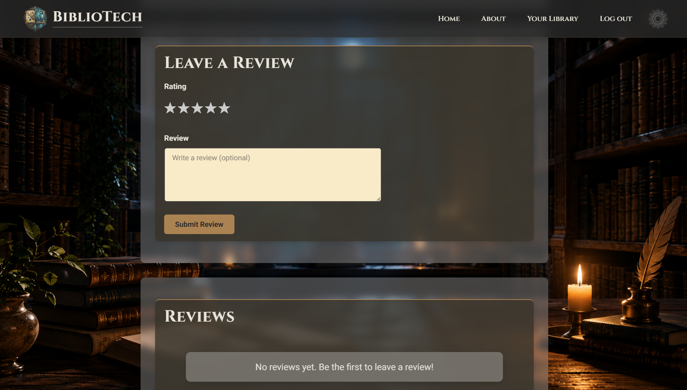
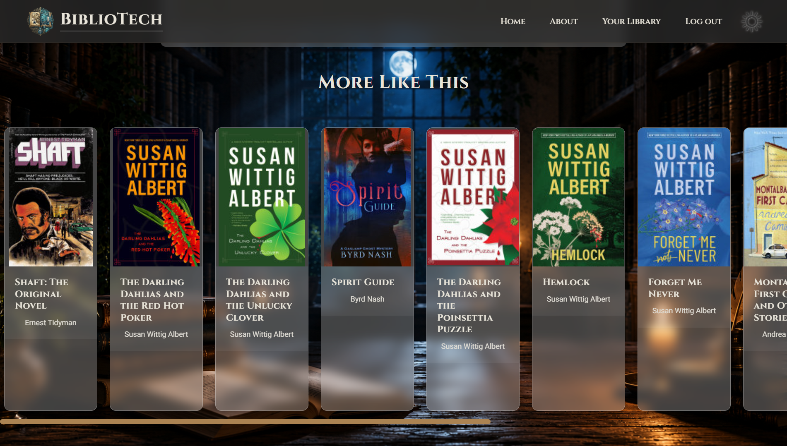

# BiblioTech - Discover Your Next Great Read

BiblioTech is a full-stack Flask web application that allows users to discover books using the Google Books API, build a personal library, write reviews, and manage their account.

The application uses PostgreSQL for persistent storage and follows the Flask application factory pattern with Blueprints for maintainability and scalability.

---

# Site Logo


---

## Application Link

### Live Site: [BiblioTech - Discover Your Next Great Read](https://bibliotech-ifum.onrender.com)

## Deployment

The application is deployed on Render using Gunicorn and PostgreSQL.

**Render Web Service configuration:**

- Build command: `pip install -r requirements.txt`
- Start command: `gunicorn run:app`
- Environment variables set in the Render dashboard:
  - `SECRET_KEY`
  - `DATABASE_URL` (provided automatically by the linked Render PostgreSQL instance)

**Database:**

A Render PostgreSQL add-on is linked to the web service. Migrations are applied against the production database using:

```bash
python -m flask db upgrade
```

---

## Technologies Used

- Python
- Flask
- PostgreSQL
- SQLAlchemy
- Flask-Migrate
- Flask-Login
- Flask-Bcrypt
- Google Books API
- HTML
- CSS
- JavaScript

---

## Key Skills Demonstrated

- Flask application factory pattern
- Blueprints and modular routing
- REST API integration
- PostgreSQL relational database design
- SQLAlchemy ORM
- Database migrations with Flask-Migrate
- Authentication and session management
- CRUD operations
- Password hashing with Flask-Bcrypt
- Responsive frontend development

---

## Features

Authentication
- Register
- Login
- Logout
- Secure password hashing

Book Discovery
- Search
- Live search suggestions with autocomplete
- Pagination
- Book details
- Genre-based browsing
- Homepage featuring a dynamically generated book carousel organised by genre.

Personal Library
- Save books
- Remove books
- View saved book collection
- Track when books were added

Reviews
- Ratings
- Edit
- Delete

Account
- Delete account with password confirmation
- Preserve reviews after account deletion

---

## Homepage Features

- Random literary quote displayed on each visit.
- Google Books powered carousel
- Genre-based random book recommendations
- Automatic carousel rotation with navigation controls
- Fallback handling for missing book covers
- Genre grid linking directly to search results

---

## Review Features

- Authenticated users can leave a 1-5 star rating and optional written review.
- Users can edit or delete their own reviews.
- Reviews are displayed on book detail pages for all visitors.
- Database constraints prevent duplicate reviews from the same user on the same book.
- Reviews are preserved after account deletion and displayed as belonging to a deleted user.

---

## Architecture

The project follows the Flask application factory pattern.

- Blueprints separate authentication and main application routes.
- SQLAlchemy manages database models.
- Helper functions encapsulate Google Books API interactions.
- Flask-Migrate manages schema migrations.
- Flask-Login handles authentication.

---

## Database

The application uses PostgreSQL with SQLAlchemy ORM.

Core tables include:

- users
- books
- reviews
- user_library

Relationships are enforced using foreign keys and cascading behaviour where appropriate.

---

## Project Structure

```text
BiblioTech/
│
├── migrations/
├── tests/
│
├── run.py
├── Procfile
├── requirements.txt
│
├── app/
│   ├── __init__.py
│   ├── config.py
│   ├── models.py
│   ├── routes.py
│   ├── helpers.py
│   ├── auth/
│   │   ├── __init__.py
│   │   └── routes.py
│   │
│   ├── templates/
│   │
│   └── static/
│       ├── css/
│       ├── js/
│       └── data/
│           └── quotes.json
│
└── docs/
```

---

## Setup

1. Open a terminal in the `BiblioTech` folder.
2. Activate the virtual environment:
   - PowerShell: `.\.venv\Scripts\Activate.ps1`
   - Command Prompt: `.\.venv\Scripts\activate.bat`
3. Install dependencies:

```bash
pip install -r requirements.txt
```

4. (Optional but recommended) set environment variables:
   - `SECRET_KEY`
   - `DATABASE_URL`

5. Apply the database migrations:

```bash
python -m flask db upgrade
```

For hosted PostgreSQL (for example Render), ensure your `DATABASE_URL` includes `sslmode=require`.

---

## Run

Local development:

```bash
python run.py
```

Gunicorn deployment:

```bash
gunicorn run:app
```

For database management commands:

```bash
python -m flask db <command>
```
---

## Testing

The project includes automated tests using pytest to verify core application functionality.

The application uses a dedicated PostgreSQL test database for automated testing, keeping development data separate from test data.

Run the test suite:

```bash
python -m pytest
```

The test suite covers:

- Authentication
- Application routes
- Error pages
- Personal library
- Reviews

### Pytest Successful Run



---

## Routing Structure

- `app/routes.py` → main pages (`/`, `/search-results`, `/auto-complete`, `/book/<book_id>`, `/book/<book_id>/review`, `/book/<book_id>/review/delete`, `/library`, `/library/delete`, `/library/add/<book_id>`, `/library/remove<book_id>`, `/genre/<genre>`, `/about`)
- `app/auth/routes.py` → auth routes (`/auth/login`, `/auth/signup`, `/auth/logout`)
- `app/auth/__init__.py` → auth blueprint setup

Template links and redirects for authentication use blueprint-qualified endpoints:

- `url_for('auth.login')`
- `url_for('auth.signup')`
- `url_for('auth.logout')`

---

## Implemented Routes

| Route | Purpose |
|-------|---------|
| `/` | Homepage |
| `/search-results` | Search books |
| `/auto-complete`  | Search Autocomplete |
| `/book/<book_id>` | Book details |
| `/book/<book_id>/review` | Create or update review |
| `/book/<book_id>/review/delete` | Delete review |
| `/library` | Personal library |
| `/library/add/<book_id>` | Add book to personal library |
| `/library/remove/<book_id>` | Remove book from personal library |
| `/genre/<subject>` | Browse books by genre |
| `/library/delete` | Delete user account |
| `/about` | About page |
| `/auth/login` | Login |
| `/auth/signup` | Register |
| `/auth/logout` | Logout |

---

## Documentation

- Planning: [docs/Planning.md](docs/Planning.md)
- Documentation: [docs/BiblioTech-Documentation.md](docs/BiblioTech-Documentation.md)

---

## Screenshots

### Homepage 


### Your Library


### Book Detail Reviews



### More Like This

